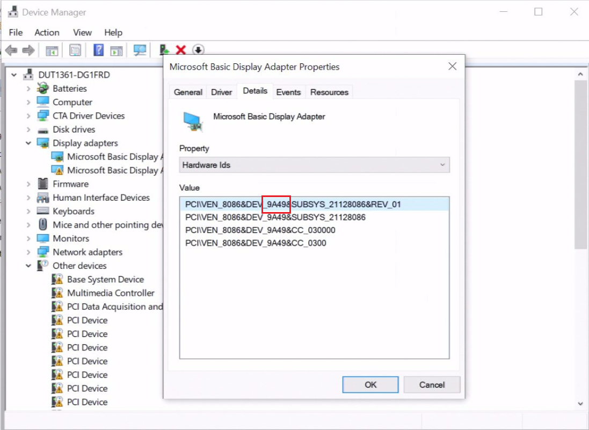
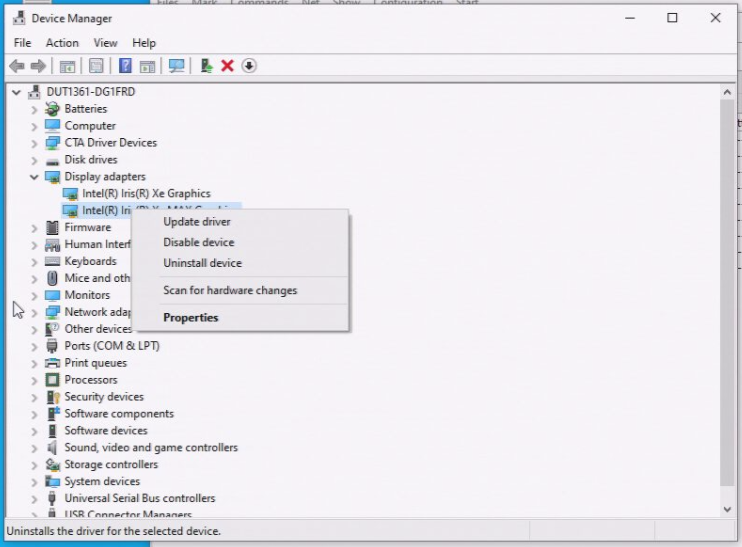
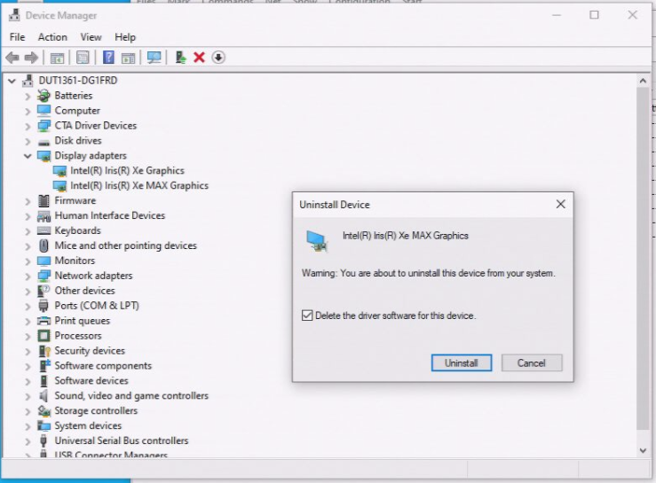
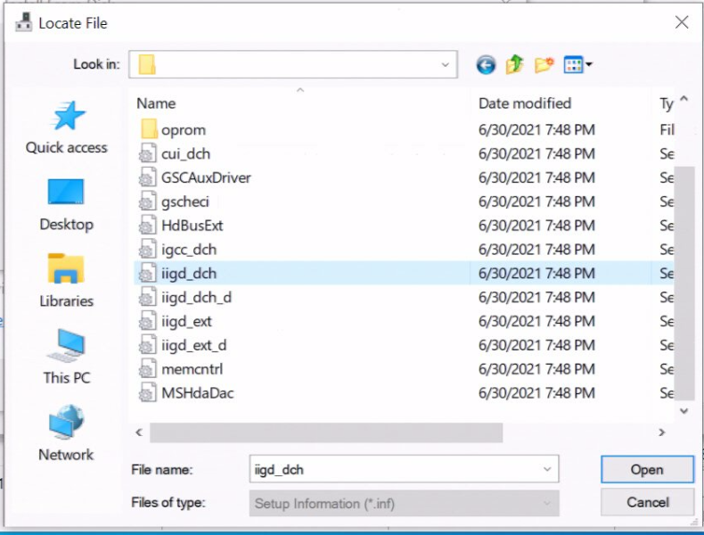
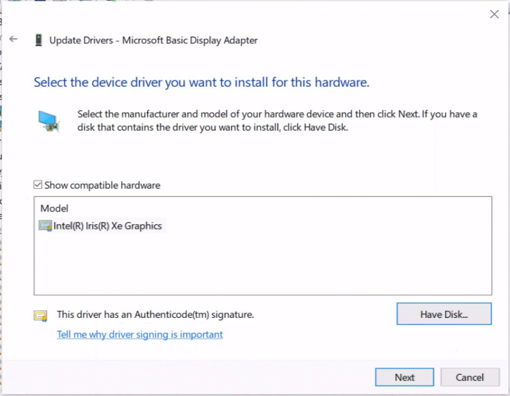
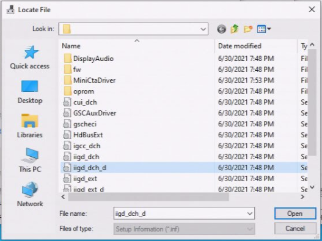
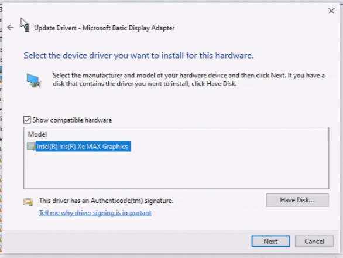
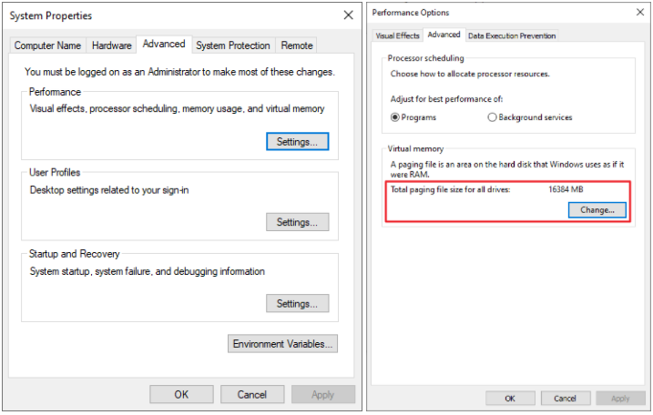
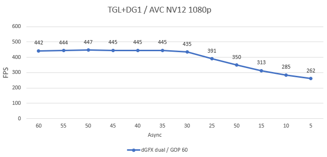

# **Intel® oneVPL Deep Link Hyper Encode Feature Developer Guide**

<div style="page-break-before:always" />

**LEGAL DISCLAIMER**

INFORMATION IN THIS DOCUMENT IS PROVIDED IN CONNECTION WITH INTEL PRODUCTS. NO LICENSE, EXPRESS OR IMPLIED, BY ESTOPPEL OR OTHERWISE, TO ANY INTELLECTUAL PROPERTY RIGHTS IS GRANTED BY THIS DOCUMENT.  EXCEPT AS PROVIDED IN INTEL'S TERMS AND CONDITIONS OF SALE FOR SUCH PRODUCTS, INTEL ASSUMES NO LIABILITY WHATSOEVER AND INTEL DISCLAIMS ANY EXPRESS OR IMPLIED WARRANTY, RELATING TO SALE AND/OR USE OF INTEL PRODUCTS INCLUDING LIABILITY OR WARRANTIES RELATING TO FITNESS FOR A PARTICULAR PURPOSE, MERCHANTABILITY, OR INFRINGEMENT OF ANY PATENT, COPYRIGHT OR OTHER INTELLECTUAL PROPERTY RIGHT.

UNLESS OTHERWISE AGREED IN WRITING BY INTEL, THE INTEL PRODUCTS ARE NOT DESIGNED NOR INTENDED FOR ANY APPLICATION IN WHICH THE FAILURE OF THE INTEL PRODUCT COULD CREATE A SITUATION WHERE PERSONAL INJURY OR DEATH MAY OCCUR.

Intel may make changes to specifications and product descriptions at any time, without notice. Designers must not rely on the absence or characteristics of any features or instructions marked "reserved" or "undefined." Intel reserves these for future definition and shall have no responsibility whatsoever for conflicts or incompatibilities arising from future changes to them. The information here is subject to change without notice. Do not finalize a design with this information. 

The products described in this document may contain design defects or errors known as errata which may cause the product to deviate from published specifications. Current characterized errata are available on request. 

Contact your local Intel sales office or your distributor to obtain the latest specifications and before placing your product order. 

Copies of documents which have an order number and are referenced in this document, or other Intel literature, may be obtained by calling 1-800-548-4725, or by visiting [Intel's Web Site](http://www.intel.com/).

MPEG is an international standard for video compression/decompression promoted by ISO. Implementations of MPEG CODECs, or MPEG enabled platforms may require licenses from various entities, including Intel Corporation.

Intel and the Intel logo are trademarks or registered trademarks of Intel Corporation or its subsidiaries in the United States and other countries.

\*Other names and brands may be claimed as the property of others.

Copyright © 2020-2023, Intel Corporation. All Rights reserved.
<div style="page-break-before:always" />

- [Overview](#overview)
- [Developer guide](#developer-guide)
  * [Feature API](#feature-api)
  * [Migrating your application from Intel Media SDK to Intel oneVPL](#migrating-your-application-from-intel-media-sdk-to-intel-onevpl)
  * [How to install graphic driver](#how-to-install-graphic-driver)
  * [How to prepare the system](#how-to-prepare-the-system)
  * [Running application with oneVPL runtime](#running-application-with-onevpl-runtime)
  * [How to get the best performance](#how-to-get-the-best-performance)
  * [Choice of async value](#choice-of-async-value)
  * [Recommendations for GOP size](#recommendations-for-gop-size)
  * [CPU and system memory utilization on the 4K streams](#cpu-and-system-memory-utilization-on-the-4K-streams)
- [Release Notes](#release-notes)
  * [Supported configurations](#supported-configurations)
  * [Known limitations](#known-limitations)

# Overview

Intel(R) oneVPL Deep Link Hyper Encode Feature leverages Intel integrated and discrete graphics on one system to accelerate encoding of a single video stream. The feature is exposed through Intel oneVPL [API](https://spec.oneapi.com/versions/latest/elements/oneVPL/source/index.html) and implemented in oneVPL GPU runtimes delivered with Intel graphics drivers.

For the sake of readability, we will refer to the following Intel processor families by their former codenames:

-   Intel Xe discrete graphics will be referred to as "DG1"
-   Intel® Arc™ Alchemist graphics will be referred to as "DG2"
-   11th Generation Intel® Core™ Processors will be referred to as "TGL" (Tiger Lake)
-   12th Generation Intel® Core™ Processors with Intel® Iris® Xe Graphics and Intel® UHD Graphics will be referred to as "ADL" (Alder Lake)

# Developer guide

## Feature API

- The feature is enabled and configured through `mfxExtHyperModeParam mfxExtBuffer` interface:
```c++
/*! The mfxHyperMode enumerator describes HyperMode implementation behavior. */
typedef enum {
    MFX_HYPERMODE_OFF = 0x0,        /*!< Don't use HyperMode implementation. */
    MFX_HYPERMODE_ON = 0x1,         /*!< Enable HyperMode implementation and return error if some issue on initialization. */
    MFX_HYPERMODE_ADAPTIVE = 0x2,   /*!< Enable HyperMode implementation and switch to single fallback if some issue on initialization. */
} mfxHyperMode;

/*! The structure is used for HyperMode initialization. */
typedef struct {
    mfxExtBuffer    Header;         /*!< Extension buffer header. BufferId must be equal to MFX_EXTBUFF_HYPER_MODE_PARAM. */
    mfxHyperMode    Mode;           /*!< HyperMode implementation behavior. */
    mfxU16          reserved[19];
} mfxExtHyperModeParam;
```
- Application must attach `mfxExtHyperModeParam` structure to the list of extension buffers for encoder’s `mfxVideoParam`:
```c++
mfxVideoParam par;
par.NumExtParam = 1;
par.ExtParam = new mfxExtBuffer * [par.NumExtParam];

auto hyperModeParam = new mfxExtHyperModeParam;
hyperModeParam->Mode = MFX_HYPERMODE_ON;

par.ExtParam[0]->BufferId = MFX_EXTBUFF_HYPER_MODE_PARAM;
par.ExtParam[0] = &hyperEncodeParam->Header;
```

## Migrating your application from Intel Media SDK to Intel oneVPL

1. Rebuild your application with new oneVPL headers and link application with oneVPL dispatcher from the package.
2. Change MFX session initialization in the following way (check sample_encode source for reference):

From
```c++
mfxSession session;
mfxIMPL impl = MFX_IMPL_HARDWARE;
mfxVersion version = { {1,1} };
MFXInit(impl, &version, &session);
```

To    
```c++
mfxLoader loader = MFXLoad();
mfxConfig cfg = MFXCreateConfig(loader);
mfxVariant ImplValue;
ImplValue.Type = MFX_VARIANT_TYPE_U32;
ImplValue.Data.U32 = MFX_IMPL_TYPE_HARDWARE;
MFXSetConfigFilterProperty(cfg,"mfxImplDescription.Impl",ImplValue);
MFXCreateSession(loader,0,&session);
```

3. Please pay attention to `MaxLength` field of `mfxBitstream` structure during bitstream allocation for encoder output. It must be set using `par.mfx.BufferSizeInKB` and `par.mfx.BRCParamMultiplier` (if it's not zero). Bigger `MaxLength` values will lead to huge memory consumption on Deep Link Hyper Encode.
```c++
mfxVideoParam par;
mfxStatus sts = encoder->GetVideoParam(&par);
mfxBitstream bs;
bs.MaxLength = par.mfx.BufferSizeInKB * par.mfx.BRCParamMultiplier;
```

4. For more information please refer to full migration guide [here](https://software.intel.com/content/www/us/en/develop/articles/upgrading-from-msdk-to-onevpl.html)

## How to install graphic driver

* Go to `device manager` -> `display adapters`. Determine which adapter is integrated and which is discrete by `DeviceID` as illustrated on Figure 1.
###### Figure 1: Display Adapter Properties


* Uninstall driver from integrated and discrete adapters as illustrated on Figure 2.
###### Figure 2: Device Manager Adapter Uninstall



* Install driver on integrated and discrete adapters: `Update driver` -> `Browse my computer for drivers` -> `Let me pick from a list of available drivers on my computer`. Select `iigd_dch.inf` for integrated adapter and `iigd_dch_d.inf` for discrete as illustrated on Figure 3.
###### Figure 3: Device Manager Adapter Install





## How to prepare the system

HW/SW requirements:

1. iGPU: TGL/ADL
2. dGPU: DG1/DG2

Set virtual memory not less than physical memory size as illustrated on Figure 4.
###### Figure 4: System Settings


## Running sample_encode with oneVPL runtime

1. Download and install the graphics driver, containing oneVPL GPU runtime.
2. Download and install the [oneVPL Toolkit](https://software.intel.com/content/www/us/en/develop/tools/oneapi/components/onevpl.html), containing pre-built sample_encode and oneVPL dispatcher.
3. Find `sample_encode.exe` application in the pre-built `bin` directory of the oneVPL Toolkit installation folder.
4. Run Command Prompt under administrative rights.
5. Run simple example of sample_encode command line with enabled Deep Link Hyper Encode feature:
```bash
sample_encode h264 -i input.yuv -o output.h264 -dGfx -dual_gfx::on -w 1920 -h 1080 -nv12 -idr_interval 0 -d3d11 -async 30 -g 30 -r 1 -u 4 -lowpower:on -perf_opt 10 -n 2000        
```
6. Sample_encode source code please find [here](https://github.com/oneapi-src/oneVPL/commits/master).

## How to get the best performance

sample_encode tool has performance mode. This mode enables by using `-perf_opt n` option. It sets `n` prefetched frames (application preallocates buffers and preload `n` first frames to buffers from input stream). Performance mode allows to evaluate clear benefit of the Deep Link Hyper Encode feature, excluding input stream reading from measurements and providing permanent load of Deep Link Hyper Encode with input surfaces. And this is the main requirement for the applications, otherwise Deep Link Hyper Encode will not bring performance improvement if it will not be loaded enough with new surfaces.

## Choice of async value

Figure 6 shows performance dependency from the async value. For example, for AVC NV12 4K GOP=60 – common async value threshold is 35. It means, that for async>=35 there are no performance lost and at the same time lower async value helps to reduce memory consumption. For async<35 performance fall lower than 445 fps.

But please pay attention, that these data depend on the system configuration (especially physical memory size) and application, in which LE library would be integrated. So, this chart cannot be universal recommendation for optimal async value selection. The chart is for informational purposes only to show possibility of using async value lower than GOP size without performance lost.
###### Figure 6: Async Values


## Recommendations for GOP size

Deep Link Hyper Encode don’t have particular recommendations about GOP size. With gop size increasing, the probability of 2nd adapther wait increases, that may be the reason of performance regression. Also with bigger gop size, async value must be increased to have enough queue of input surfaces for hyper encode, that would be the reason of memory consumption growth.

## CPU utilization on the 4K streams

Typical CPU usage on sample_encode application with 4K streams (GOP size 30, async depth 30, input video(dx11) memory, sample_encode `perf_opt` option enabled) does not exceed 8%. Please pay attention, that these data show usages on clear encoding pipeline and depends on the Deep Link Hyper Encode configuration parameters.

# Release Notes

## Supported configurations

- Supported OS: Windows.
- Deep Link Hyper Encode was tested on TGL+DG1/TGL+DG2/ADL+DG2.
- Supports AVC, HEVC, AV1 encoders in low power mode (VDENC); Direct3D11 and system memory surfaces in NV12/P010/RGB format; VBR/CQP/ICQ/CBR/QVBR bitrate controls with disabled HRD-compliance.

## Known limitations

- If encoder configured with MFX_HYPERMODE_ADAPTIVE it will automatically fall back to single GPU when underlying parameter combination is not supported for hyper encoding.
- Deep Link Hyper Encode check codec/feature support on each adapter and if encoder on primary adapter don't support it, Hyper Encode will return MFX_ERR_UNSUPPORTED: 
  - as AVC B-frames and AV1 are supported on DG2 and not supported on TGL, Hyper Encode will accelerate encoding with 2VDBOX on DG2 if it's primary adapter and will return MFX_ERR_UNSUPPORTED in the case of TGL is primary adapter;
  - if application don't set the number of B-frames Deep Link Hyper Encode will try to set the default value from the primary adapter for both adapters to check if it's supported. If primary adapter supports lower value of B-frames, then encoders will be initialized on both adapters with this value. If primary adapter supports greater value of B-frames, then encoders will be initialized only on primray adapter.
- For achieving good performance, we recommend using async value not less than GOP size, but this might be not possible to achieve due to memory volume limitation, then we recommend tuning down and share sample based measurement for reference.
- Possible low performance gain in the case of fast encoder (target usage 7) on transcoding scenarios due to insufficient encoder loading.
- For achieving the best performance in Hyper Encode mode we recommend to use system memory surfaces (especially in case of P010 and RGB32 formats). Starting from driver version 31.0.101.4314, a number of maximum VDBOX being utilized was increased from 2 to 3 when available (one on primary GPU and two on secondary). Performance depends on format of surfaces and type of memory used: 
  - Video memory (DX11). Significant performance improvement when using NV12 surface format but slight performance degradation for P010 and RGB32 formats. 
  - System memory. Performance boost for all supported formats.
